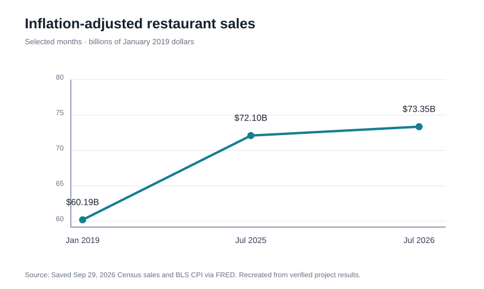
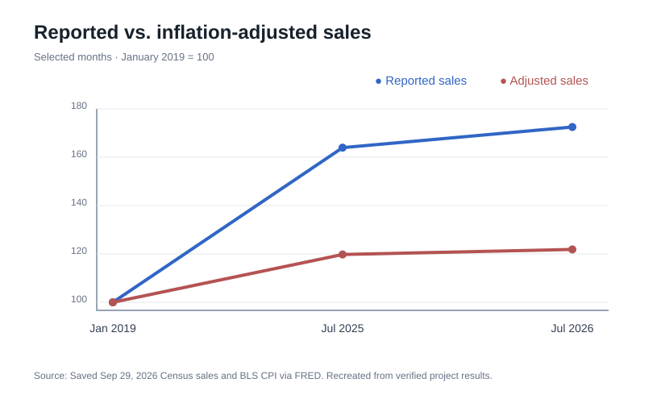
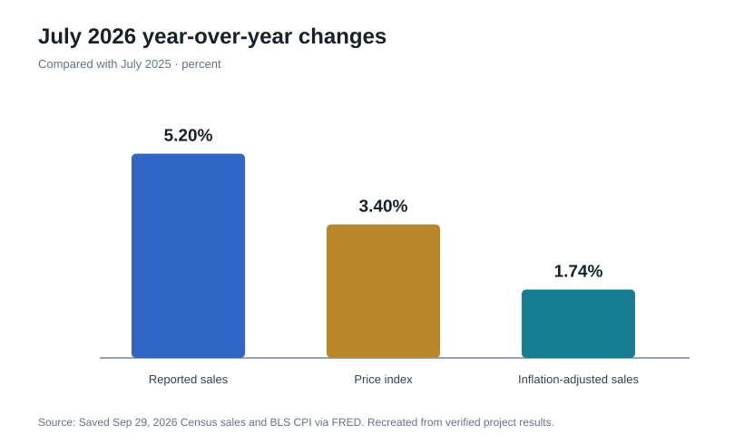

# Restaurant Sales Growth and Inflation (2010–2026)

**Independent business analytics project · Akshitha Kaleru · R / RStudio**

## Business question

Are U.S. food services and drinking places growing after accounting for higher food-away-from-home prices?

## Main results

Using the **September 29, 2026 saved data snapshot**, the project found:

| Metric | July 2026 |
| --- | ---: |
| Reported monthly sales | **$103.824 billion** |
| Inflation-adjusted monthly sales (January 2019 prices) | **$73.351 billion** |
| Reported year-over-year growth | **5.20%** |
| Food-away-from-home CPI change | **3.40%** |
| Inflation-adjusted growth | **1.74%** |
| Reported growth since January 2019 | **72.48%** |
| Adjusted growth since January 2019 | **21.86%** |

**Finding:** Sales growth remained positive after the price adjustment, but was substantially lower than the growth in reported dollars. Adjusted revenue is **not** the same as customer visits, meal quantities, same-store growth or profitability.

## Methods and data

- U.S. Census **MRTSSM722USS** monthly food services/drinking places sales (millions USD)
- BLS **CUSR0000SEFV** food-away-from-home CPI (1982–84=100)
- Both series accessed through [FRED](https://fred.stlouisfed.org)
- 199 monthly sales observations (January 2010–July 2026); 200 CPI observations (through August 2026)
- Left join by month; one missing CPI value in October 2025 is **preserved**, not interpolated
- Inflation adjustment: `real_sales = reported_sales × CPI_Jan2019 / CPI_month`
- Year-over-year growth matches the exact calendar month one year earlier

No regression, forecasting, qualitative coding, or causal identification is claimed.

## Reviewer navigation

| Area | File |
| --- | --- |
| Original R analysis script | [scripts/analyze_restaurant_sales.R](scripts/analyze_restaurant_sales.R) |
| Results from original snapshot | [docs/reported-results.md](docs/reported-results.md) |
| Validation and reproduction notes | [docs/verification.md](docs/verification.md) |
| Saved project output | [outputs/latest_month_summary.csv](outputs/latest_month_summary.csv) |
| Visual results | [Three charts](#visual-results) (SVG versions recreated from verified saved values) |

## Visual results

The charts below were recreated from the verified saved output values. The first two compare **selected months**, rather than presenting all 199 monthly observations. The three full-resolution original PNG plots are preserved in the local project ZIP.

### Inflation-adjusted restaurant sales — selected months



### Reported versus adjusted sales — selected months



### July 2026 year-over-year growth



## Technical skills

**R/RStudio:** reading and validating CSV files, date conversion, left joins, missing-data preservation, exact month matching, vectorized calculations, indexed comparisons, consistency checks, and chart exports.

**Business analytics:** separating reported revenue from inflation-adjusted trends, communicating limitations and creating interpretable data products.

## Reproducing the original results

The original R script is restored from the project ZIP and requires the two September 29, 2026 FRED CSV snapshots placed at:

- `data/raw/MRTSSM722USS.csv`
- `data/raw/CUSR0000SEFV.csv`

From the repository root in RStudio:

```r
source("scripts/analyze_restaurant_sales.R")
```

The repository currently excludes the raw CSVs from Git tracking; they are retained in the original ZIP package. Because these are public aggregate monthly economic statistics, publishing the two small saved CSV snapshots would also be appropriate if desired. Current FRED downloads may be revised and may not reproduce this exact snapshot.

**Verification:** Both source CSV SHA-256 hashes matched the original validation record. An independent Python recalculation reproduced the 199-row processed monthly data to numerical floating-point precision and matched the original July 2026 summary. The original R script has **not** been rerun in an R environment here.

## Sources

- [FRED: MRTSSM722USS](https://fred.stlouisfed.org/series/MRTSSM722USS)
- [FRED: CUSR0000SEFV](https://fred.stlouisfed.org/series/CUSR0000SEFV)
- [BLS: constant dollars](https://www.bls.gov/cpi/factsheets/purchasing-power-constant-dollars.htm)
