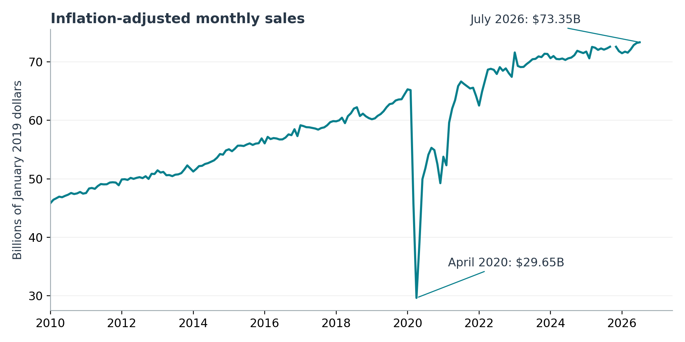
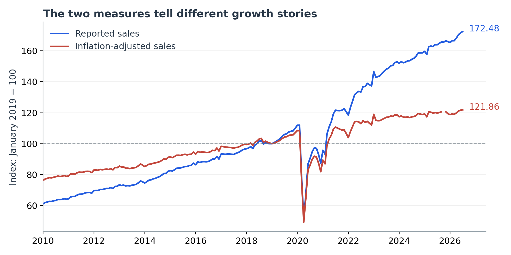
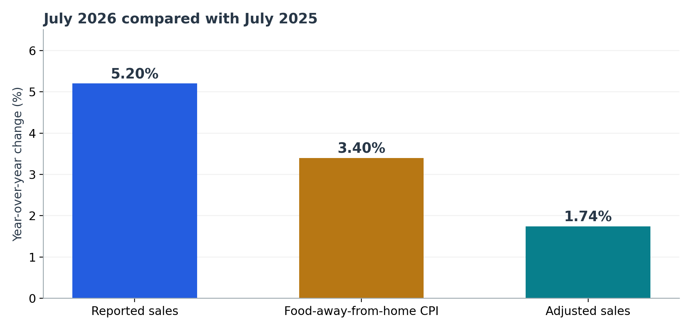

# Restaurant Sales Growth and Inflation (2010–2026)

**Independent business analytics project · Akshitha Kaleru · R / RStudio**

## Business question

Are U.S. food services and drinking places growing after accounting for higher food-away-from-home prices?

## Main results

Using the **September 29, 2026 saved data snapshot**, the project found:

| Metric | July 2026 |
| --- | ---: |
| Reported monthly sales | **$103.824 billion** |
| Inflation-adjusted monthly sales (January 2019 prices) | **$73.351 billion** |
| Reported year-over-year growth | **5.20%** |
| Food-away-from-home CPI change | **3.40%** |
| Inflation-adjusted growth | **1.74%** |
| Reported growth since January 2019 | **72.48%** |
| Adjusted growth since January 2019 | **21.86%** |

**Finding:** Sales growth remained positive after the price adjustment, but was substantially lower than the growth in reported dollars. Adjusted revenue is **not** the same as customer visits, meal quantities, same-store growth or profitability.

## Methods and data

- U.S. Census **MRTSSM722USS** monthly food services/drinking places sales (millions USD)
- BLS **CUSR0000SEFV** food-away-from-home CPI (1982–84=100)
- Both series accessed through [FRED](https://fred.stlouisfed.org)
- 199 monthly sales observations (January 2010–July 2026); 200 CPI observations (through August 2026)
- Left join by month; one missing CPI value in October 2025 is **preserved**, not interpolated
- Inflation adjustment: `real_sales = reported_sales × CPI_Jan2019 / CPI_month`
- Year-over-year growth matches the exact calendar month one year earlier

No regression, forecasting, qualitative coding, or causal identification is claimed.

## Reviewer navigation

| Area | File |
| --- | --- |
| Original R analysis script | [scripts/analyze_restaurant_sales.R](scripts/analyze_restaurant_sales.R) |
| Results from original snapshot | [docs/reported-results.md](docs/reported-results.md) |
| Validation and reproduction notes | [docs/verification.md](docs/verification.md) |
| Original validation record | [outputs/validation_record.json](outputs/validation_record.json) |
| Saved project output | [outputs/latest_month_summary.csv](outputs/latest_month_summary.csv) |
| Original charts | [Three full charts](#visual-results) |
| Final research report | [Restaurant Sales and Inflation Report (PDF)](docs/Restaurant_Sales_and_Inflation_Report.pdf) |
| Source CSVs | [Sales](data/raw/MRTSSM722USS.csv) · [CPI](data/raw/CUSR0000SEFV.csv) |

## Visual results

These are the **original charts from the saved project output**, covering the full study period where applicable. The October 2025 CPI value remains missing rather than interpolated.

### Inflation-adjusted restaurant sales



### Reported versus inflation-adjusted sales



### July 2026 year-over-year growth comparison



For the full methods, interpretation, and limitations, see the [final PDF report](docs/Restaurant_Sales_and_Inflation_Report.pdf).

## Technical skills

**R/RStudio:** reading and validating CSV files, date conversion, left joins, missing-data preservation, exact month matching, vectorized calculations, indexed comparisons, consistency checks, and chart exports.

**Business analytics:** separating reported revenue from inflation-adjusted trends, communicating limitations and creating interpretable data products.

## Reproducing the original results

The original project's R analysis script was restored to `scripts/` from the supplied ZIP. To reproduce the saved September 29, 2026 snapshot, it requires the two CSV files placed at:

- `data/raw/MRTSSM722USS.csv`
- `data/raw/CUSR0000SEFV.csv`

From the repository root in RStudio:

```r
source("scripts/analyze_restaurant_sales.R")
```

Both saved public, aggregate FRED CSV snapshots are now provided in `data/raw/`, allowing the original snapshot to be reproduced without downloading potentially revised live series. Current FRED downloads may be revised and may not reproduce this exact snapshot.

**Verification:** Both source CSV SHA-256 hashes matched the original validation record. An independent Python recalculation reproduced the 199-row processed monthly data to numerical floating-point precision and matched the original July 2026 summary. The original R script has **not** been rerun in an R environment here.

## Sources

- [FRED: MRTSSM722USS](https://fred.stlouisfed.org/series/MRTSSM722USS)
- [FRED: CUSR0000SEFV](https://fred.stlouisfed.org/series/CUSR0000SEFV)
- [BLS: constant dollars](https://www.bls.gov/cpi/factsheets/purchasing-power-constant-dollars.htm)
